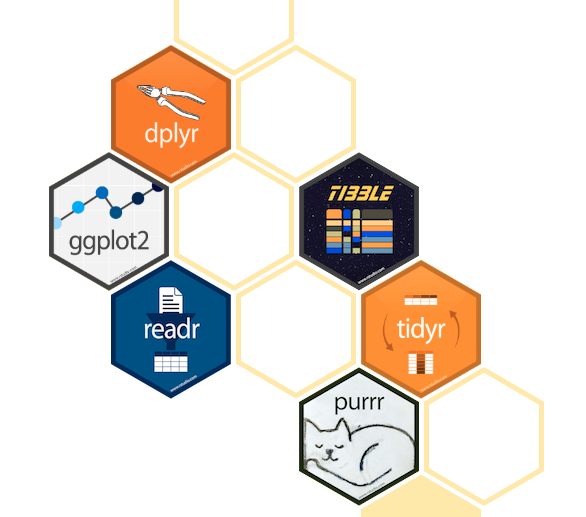

# Webinar: Introducción a R con RStudio

-  `#c5f015`

###### [:lemon: Lemon – Ice :snowflake:](https://www.delarivagroup.com/estudios-de-mercado/investigacion-cuantitativa/)

#### Objetivo del Webinar

El objetivo de este curso es que puedas conocer el entorno de desarrollo RStudio y que puedas ejecutar sentencias básicas de R para poder generar reportes. Además de poder contar con las herramientas básicas para que por tu lado puedas ir adquiriendo nuevos conocimientos y puedas desarrollarte como un programador de R.

#### Antes de comenzar
Recuerda que debes tener instalado en maquina R-Cran y RStudio ([Manual de Descarga e Istalación](./1w_Instalacion_R.pdf))

#### Este curso se dividirá en 3 días de webinar, los cuales abarcaran los siguientes tópicos:

1. [Dia I](./Dia_I)
	* [Sesión 1 - Entorno de desarrollo integrado (RStudio)]()
	* [Sesión 2 - Importación y manipulación de Data Frames]()
2. [Dia II]()
	* [Sesión 3 - Introducción a Tidyverse]()
	* [Sesión 4 - Visualización de datos con ggplot2]()
3. [Dia III]()
	* [Sesión 5 - Análisis exploratorio de datos]()
	* [Sesión 6 - Creación de reportes]()
	
#### Recursos Adicionales
* Cheat Sheets
	* [RStudio - IDE](./CheatSheets/rstudio-ide.pdf)
	* [Base R](./CheatSheets/base-r.pdf)
	* [Tidyverse](./CheatSheets/Tidyverse+Cheat+Sheet.pdf)
	* [Ggplot2](./CheatSheets/data-visualization-2.1.pdf)
	* [Data Wrangling](./CheatSheets/data-wrangling-cheatsheet.pdf)
	* [RMarkdown](./CheatSheets/rmarkdown-cheatsheet-2.0.pdf)
* Libros
	* [R for Data Science](https://r4ds.had.co.nz/)
	* [R Markdown: The Definitive Guide](https://bookdown.org/yihui/rmarkdown/)
* Ligas de interés 
	* [R Project](https://www.r-project.org/)
	* [RStudio](https://rstudio.com/)
	* [R-Bloggers](https://www.r-bloggers.com/)
	* [R-Exercises](https://www.r-exercises.com)

